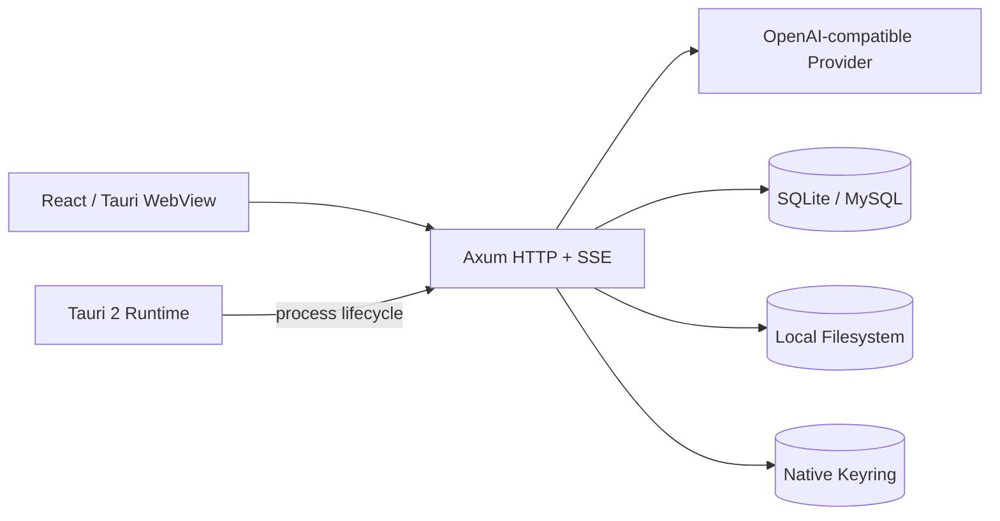
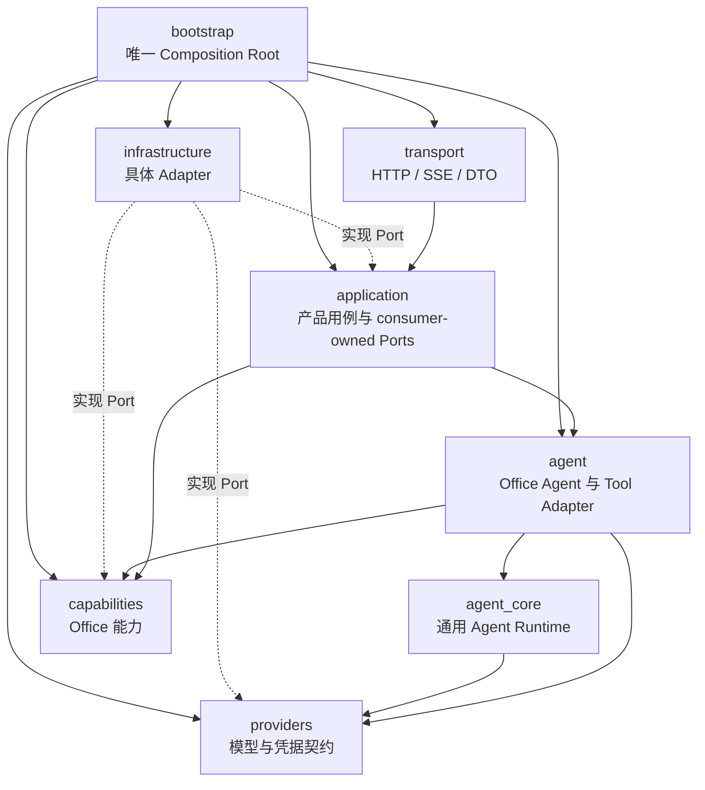
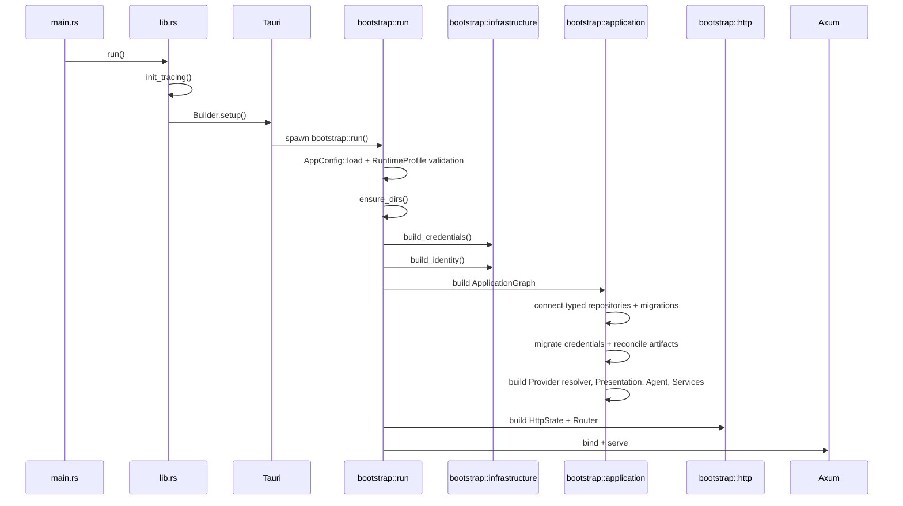
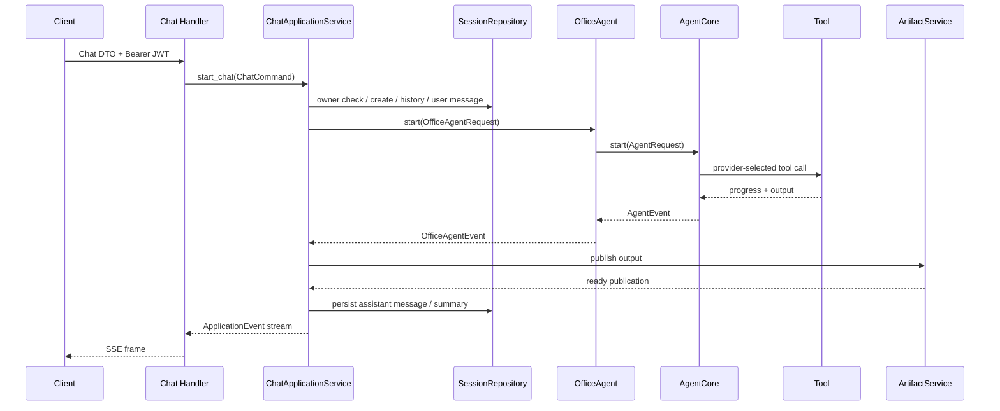
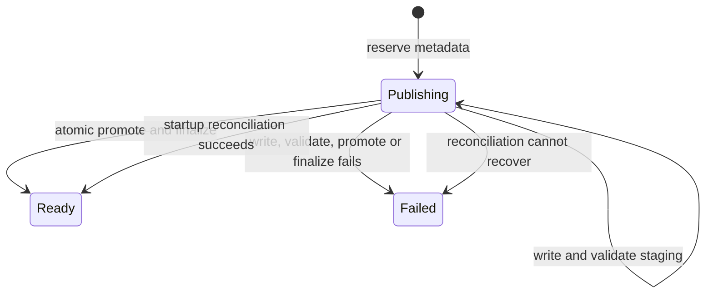

# 后端架构说明

## 文档元数据

| 字段 | 值 |
| --- | --- |
| 文档 ID | `ARCH-BACKEND-001` |
| 文档类型 | 当前态架构说明，描述已运行的实现，不是目标方案或迁移计划 |
| 状态 | Current |
| 架构代际 | Agent-first 模块化单体 v1，S-007 收敛后 |
| 文档修订 | 1.0 |
| 最后核验日期 | 2026-10-03 |
| 核验基线 | 生产实现 commit `c3a9406b099493a885cd736995954a8f65327a94`；验证 commit `335e7472f911be25ae46c9dfe7cf6063736ac1cb` |
| 代码范围 | `src-tauri/src/`、`src-tauri/tests/`、`migrations/`、`src-tauri/Cargo.toml` |
| 事实来源优先级 | 当前代码与架构测试高于本文；本文高于旧 Spec 中的目标目录示例 |
| 关联决策 | [`ADR-001`](../adr/ADR-001-adopt-agent-first-modular-architecture.md)，状态 Accepted |
| 关联实施记录 | `.sdd/agent-first-backend-architecture/tasks.md`、`.sdd/agent-first-backend-architecture/operator-guide.md` |
| 替代内容 | 替代本文旧版“分层核心 + 遗留兼容区”描述；当前已无旧 Route、全局数据库或架构 allowlist |
| 更新触发条件 | 子系统增删、依赖方向变化、Composition Root 变化、公开 HTTP/SSE 契约变化、存储或凭据策略变化 |
| 维护要求 | 修改架构时同步更新元数据、架构图、源码索引和文末变更记录，并运行架构 Gate |

> 本文只回答“当前代码如何工作”。`docs/spec/` 描述需求或目标，`docs/adr/` 记录为什么选择某项架构，`.sdd/` 记录实施和验收。若几类文档冲突，不要把旧目标结构当作当前实现，应先核对代码和 `src-tauri/tests/architecture_boundaries.rs`。

## 1. 当前结论

后端是 Rust 2024 Edition 单 Crate 模块化单体。Tauri 2 管理桌面进程生命周期，在进程内启动 Axum HTTP 服务；Tokio 提供异步运行时；SQLx 以类型化 Adapter 支持 SQLite 和 MySQL。

S-007 收敛后，所有产品 HTTP 领域都走同一条路径：

```text
HTTP Transport
    ↓
Application Service
    ↓
Agent / Capability / consumer-owned Port
    ↑
Infrastructure Adapter
```

当前不存在以下兼容结构：

- 旧 `routes/`、`db/`、`contracts/`、`ports/`、`state.rs`、`config.rs` 根模块；
- `AnyPool` 数据访问；
- 全局 `OnceLock` Service Locator；
- 第二套 Router 或数据库读写路径；
- `mod.rs`；
- 架构测试 allowlist。

`bootstrap` 是唯一选择具体实现并构造对象图的位置。`HttpState` 只保存 Application Service 和身份接口，字段私有，不暴露 SQLx Pool、Repository、Credential Store 或 Tool Registry。

## 2. 系统上下文



Tauri Command 不是主要业务入口。`lib.rs` 当前只注册示例 `greet` Command，产品能力通过 `/api/**` 和 `/outputs/**` 提供。

### 2.1 技术栈

| 类别 | 当前实现 |
| --- | --- |
| 桌面容器 | Tauri 2 |
| HTTP | Axum 0.7、Tower、Tower HTTP |
| 异步运行时 | Tokio 1 |
| 数据访问 | SQLx 0.8，运行时代码使用 `SqlitePool` 或 `MySqlPool` typed Adapter |
| 序列化 | Serde、Serde JSON |
| 身份 | JWT、bcrypt、`AuthenticatedActor` 提取器 |
| Provider | `reqwest` 驱动的 OpenAI-compatible Chat Adapter |
| 凭据 | `secrecy`、`zeroize`、Native Keyring 或只读环境变量 Store |
| Office 输出 | `docx-rs`、`rust_xlsxwriter`、PPTX OOXML Renderer |
| 文件提取 | ZIP/XML 解析；PDF 优先使用 `pdftotext` |
| 日志 | `tracing`、`tracing-subscriber` |
| 架构约束 | `syn` AST 路径分析和结构测试 |

## 3. 子系统与依赖方向

源码根只允许八个子系统门面及其同名目录，外加 `lib.rs` 和 `main.rs`：

```text
src-tauri/src/
├── providers.rs        + providers/
├── agent_core.rs       + agent_core/
├── agent.rs            + agent/
├── capabilities.rs     + capabilities/
├── application.rs      + application/
├── infrastructure.rs   + infrastructure/
├── transport.rs        + transport/
├── bootstrap.rs        + bootstrap/
├── lib.rs
└── main.rs
```

### 3.1 依赖图



虚线表示 Infrastructure 实现由需求方拥有的接口。业务模块不通过 Infrastructure 获取抽象，抽象跟随需求方放置。

### 3.2 子系统职责

| 子系统 | 门面 | 职责 | 不应承担 |
| --- | --- | --- | --- |
| `providers` | `providers.rs` | Chat Provider 契约、Provider 请求/响应、解析器、凭据接口及 OpenAI-compatible Adapter | 产品用例、HTTP Handler、数据库访问 |
| `agent_core` | `agent_core.rs` | 通用 Agent Loop、Tool Registry、取消、超时、背压、唯一终态和通用输出 | Office 业务、持久化、Axum、具体 Provider HTTP |
| `agent` | `agent.rs` | 把 Agent Core、Prompt、Office Tool 和 Capability 组装成 `AgentRunner` | Application 用例、SQLx、HTTP Transport |
| `capabilities` | `capabilities.rs` | 可脱离 Agent 复用的 Office 能力；当前为 Presentation | Axum、Tauri、具体数据库和 Provider HTTP |
| `application` | `application.rs` | 身份、会话、聊天、产物、文件、项目、导出、偏好、通知和 Dashboard 用例 | SQL、HTTP Response、具体文件格式或外部网络实现 |
| `infrastructure` | `infrastructure.rs` | SQLx、文件系统、导出、提取、身份、凭据、OCR 和 Presentation Planner Adapter | HTTP Handler、Application Service 编排、Bootstrap |
| `transport` | `transport.rs` | HTTP 路由、DTO、鉴权提取、错误映射、SSE 和静态输出服务 | SQLx、外部 Provider 调用、具体 Repository |
| `bootstrap` | `bootstrap.rs` | 读取并验证启动配置、选择 Adapter、构造对象图、启动 Axum | 业务规则或请求处理 |

### 3.3 Port 所有权

Port 由使用它的模块拥有，避免全局 `ports` 目录变成共享杂物区。

| 所有者 | 主要接口 |
| --- | --- |
| `application::identity` | `AccountRepository`、`AccountGateway`、`IdentityAdapter` |
| `application::conversations` | `SessionRepository` |
| `application::artifacts` | `ArtifactPublicationRepository`、`FileStorage` |
| `application::assets` | `AssetRepository`、`AssetStorage`、`AssetContentExtractor` |
| `application::projects` | `ProjectRepository` |
| `application::office_export` | `DocumentExporter`、`SpreadsheetExporter`、`ExportFileStore` |
| `application::preferences` | `SecurePreferencePort`、`McpConnectionTester` |
| `application::notifications` | `NotificationRepository` |
| `capabilities::presentation` | `PresentationPlanner`、`PresentationStore`、`PresentationExporter`、`PresentationProgressSink` |
| `providers` | `ChatProvider`、`ChatProviderResolver`、`CredentialStore` |
| `agent` | `AgentRunner`，供 Chat Application 调用 |

## 4. 启动与对象图

入口链路：



### 4.1 Composition Root

`bootstrap` 分为六个内部模块：

| 文件 | 职责 |
| --- | --- |
| `bootstrap/config.rs` | 加载 `.env` 和环境变量，验证 Runtime Profile、地址、CORS、身份策略和非秘密 Endpoint |
| `bootstrap/infrastructure.rs` | 构造 Credential Store、typed Account Repository、JWT Identity Adapter 和 Identity Application |
| `bootstrap/providers.rs` | 按用户偏好和凭据 revision 解析并缓存 Chat Provider |
| `bootstrap/agent.rs` | 构造实例级 Tool Registry 和 `OfficeAgent` |
| `bootstrap/application.rs` | 选择 SQLite/MySQL Adapter，构造全部 Application Service、Presentation 和 Artifact 对账 |
| `bootstrap/http.rs` | 把 Application Graph 装入私有 `HttpState`，构造 Router 和 bind address |

具体实现选择只允许出现在 Composition Root。Application、Agent、Capability 和 Transport 不读取 `DATABASE_URL` 来分支。

### 4.2 显式状态

`transport/http/state.rs` 中的 `HttpState` 使用私有字段保存：

- `IdentityState`；
- `IdentityApplicationService`；
- `ChatApplicationService`；
- `SessionApplicationService`；
- `AssetApplicationService`；
- `ProjectApplicationService`；
- `OfficeExportApplicationService`；
- `PreferenceApplicationService`；
- `NotificationApplicationService`；
- `DashboardApplicationService`。

Axum 通过 `FromRef<HttpState>` 提取所需依赖。没有全局数据库、全局 Service 或可变全局 Tool Registry。

## 5. Runtime Profile、身份与凭据

### 5.1 Profile

| 项目 | Local Desktop | Server |
| --- | --- | --- |
| `AIPPT_RUNTIME_PROFILE` | 缺省或 `local` | `server` |
| 监听地址 | 必须是 loopback，默认 `127.0.0.1:8000` | 必须显式设置 Host 和 Port |
| CORS | 只接受 localhost、loopback 和受支持的 Tauri Origin | 必须显式配置 Origin |
| 身份策略 | 默认 `local-guest`，也可 `jwt-only` | 必须显式为 `jwt-only` |
| 凭据后端 | Native Keyring，可在启动时安全导入环境变量 | 只读环境变量映射 |
| JWT Secret | 未设置时为本次进程生成随机值 | 必填，长度和多样性校验失败即停止启动 |

配置对象只保留经过验证的运行参数和 `SecretString` JWT Secret。LLM、图片、视频和搜索 API Key 不作为普通 `AppConfig` 字段保存。

### 5.2 身份链路

```text
Authorization: Bearer <proof>
    ↓
AuthenticatedActor
    ↓
IdentityAdapter::authenticate
    ↓
Actor { id, kind, roles }
    ↓
Application Service 所有权检查
```

登录、游客登录、注册和当前用户查询通过 `IdentityApplicationService`。账户持久化由 `AccountRepository` 抽象，SQLite/MySQL 各有 typed Adapter。Transport 不接触密码哈希、JWT 解码实现或数据库。

### 5.3 凭据边界

普通 Preference JSON 只保存配置和 `has_api_key`、`api_key_count` 等元数据，不保存可用秘密。秘密按 `actor + profile + provider + purpose` 建立 Scope，并绑定 Endpoint。

旧 Preference 中发现明文秘密时，迁移顺序固定为：

```text
copy to secure store
    → verify secure copy
    → compare-and-swap scrub ordinary preference row
    → reread and verify scrubbed row
```

任一步失败都停止，不回退到明文，不清除未验证的原值。Server 的环境变量 Store 为部署所有且只读；Local 的 Native Store 启动时会用随机合成记录执行读、写、删 readiness probe。

## 6. Application 用例

| 模块 | Application Service | 主要职责 |
| --- | --- | --- |
| `identity` | `IdentityApplicationService` | 登录、游客身份、注册、当前账户 |
| `conversations` | `SessionApplicationService` | owner-scoped 会话 CRUD、消息、摘要和历史 Artifact |
| `chat_service` | `ChatApplicationService` | 会话校验、历史读取、Agent 启动、消息持久化、Artifact 发布、取消与唯一终态 |
| `artifacts` | `ArtifactService` | `publishing → ready/failed` 发布、补偿和启动恢复 |
| `assets` | `AssetApplicationService` | 上传、元数据、Folder、内容提取、预览、下载和删除 |
| `projects` | `ProjectApplicationService` | 普通项目、PPT 项目、幻灯片和会话关联 |
| `office_export` | `OfficeExportApplicationService` | DOCX、XLSX 导出和受控文件读取 |
| `preferences` | `PreferenceApplicationService` | 设置读取/保存、凭据隔离、MCP 连通性测试 |
| `notifications` | `NotificationApplicationService` | owner-scoped 列表、未读、已读和删除 |
| `dashboard` | `DashboardApplicationService` | 组合 Project、Conversation、Asset、Notification 的真实查询结果 |

Dashboard 只组合其他 Application 接口。子查询失败会返回 typed error，不用伪造的零值掩盖故障。

## 7. Agent、Provider 与 Capability

### 7.1 Agent 分层

`agent_core` 是产品无关的执行内核：

- `AgentLoop` 调用 `ChatProvider`，解析 Tool Call，执行 `AgentTool`；
- `ToolRegistry` 是 Bootstrap 构造的实例级不可变注册表；
- 有界 `mpsc` channel 提供背压；
- Tokio `watch` channel 传播取消；
- `AgentCore` 统一处理取消、超时、最大轮次和唯一终态；
- Loop 禁止发送终态，终态只能由 Runtime 产生。

`agent` 是 Office 产品 Adapter：

- 把 Conversation、附件、项目和 Tool 配置转换成 `AgentRequest`；
- 通过 `ChatProviderResolver` 为用户和 Profile 选择 Provider；
- 把 `AgentEvent` 转换为稳定的 `OfficeAgentEvent`；
- 注册 Presentation Tool 和现有 Office Tool；
- 对 Application 只暴露 `AgentRunner`。

### 7.2 Provider

`providers` 定义统一的 Chat 消息、Tool Definition、Tool Call、Usage、Stop Reason 和 Provider Event。当前具体实现为 OpenAI-compatible Chat API。

`LegacySettingsProviderSelector` 是仍保留该名称的兼容 Adapter，不是旧架构分支。它从安全 Preference 接口读取用户选择，按 `(actor, profile)` 缓存 Provider，并使用随机 credential revision 判断是否需要重建。缓存键和日志不包含密钥哈希或明文。

### 7.3 Presentation Capability

Presentation 是当前完整抽出的 Capability：

- 拥有 `PresentationProject`、`PresentationSlide`、`PresentationElement` 等模型；
- 依赖 `PresentationPlanner`、`PresentationStore`、`PresentationExporter` 和进度接口；
- 可独立于 Agent、Axum、Tauri 和数据库测试；
- PPTX Renderer 直接消费 Capability 模型，不经过旧 JSON 模型往返。

`PresentationPlanTool` 和 `PresentationGenerateTool` 只是 Agent Adapter。文档、Markdown、表格、图表、Draw.io、图片、视频和 Web Search 仍通过 `OfficeToolAdapter` 接入 Agent Core，并使用 `LegacyToolProgress` 保持既有前端事件协议。这是当前明确的兼容接缝，不是第二套 Runtime。

## 8. Chat、事件与终态

入口：`POST /api/chat/stream`。



事件逐层转换：

```text
ProviderEvent
    ↓ agent_core
AgentEvent
    ↓ agent
OfficeAgentEvent
    ↓ application
ApplicationEvent
    ↓ transport/sse.rs
Public SSE Event
```

公开 SSE 事件：

| 事件 | 含义 |
| --- | --- |
| `state_update` | 思考、Tool 启动、Turn 和兼容进度 |
| `tool_result` | Tool 执行结果 |
| `project_update` | Presentation 项目建立或更新 |
| `slide_update` | 单页生成完成 |
| `artifact_update` | Artifact 已完成可靠发布，可读取或下载 |
| `message` | 助手消息已成功持久化 |
| `done` | 唯一成功终态 |
| `error` | 唯一失败终态 |

关键不变量：

- SSE 断开会 Drop `ChatEventStream` 并触发取消；
- Agent Core 只发送一个 Completed 或 Failed；
- Application 事件流异常结束时补发一个内部失败终态；
- 助手消息持久化成功后才公开 `message`；
- Artifact 达到 `ready` 后才公开 `artifact_update`；
- 发布失败会取消 Agent，并且不能发送成功 `done`。

## 9. Artifact 发布协议

Artifact 跨数据库和文件系统，采用显式状态机，不持有跨文件 I/O 的数据库事务。



正常顺序：

1. Repository `reserve` 创建 `publishing` 记录；
2. `FileStorage` 写 staging 文件；
3. 校验文件非空且满足格式要求；
4. 原子 promote 到 ready 路径；
5. Repository `finalize`；
6. 同一数据库事务更新 publication，并在 Session 存在时关联 `session_artifacts`；
7. 返回 `ready` publication。

写入、校验、promote 或 finalize 失败时执行文件删除和 Repository `fail` 补偿。Bootstrap 每次启动调用 `reconcile_pending()`，恢复进程中断留下的 `publishing` 记录。

## 10. 持久化与文件系统

### 10.1 数据库

默认使用 SQLite：

```text
sqlite://<AIPPT_DATA_DIR>/revueOffice.db?mode=rwc
```

设置 `DATABASE_URL=mysql://...` 后使用 MySQL。每个 Repository 都是明确的 SQLite 或 MySQL Adapter，上层只看到 consumer-owned Port。

| 领域 | SQLite Adapter | MySQL Adapter |
| --- | --- | --- |
| Identity | `persistence/sqlite/identity.rs` | `persistence/mysql/identity.rs` |
| Conversation + Artifact | `persistence/sqlite.rs` | `persistence/mysql.rs` |
| Assets | `persistence/sqlite/assets.rs` | `persistence/mysql/assets.rs` |
| Projects | `persistence/sqlite/projects.rs` | `persistence/mysql/projects.rs` |
| Preferences | `persistence/sqlite/preferences.rs` | `persistence/mysql/preferences.rs` |
| Notifications | `persistence/sqlite/notifications.rs` | `persistence/mysql/notifications.rs` |

迁移统一归 `infrastructure/persistence/migrations.rs` 所有，使用 `_revue_migrations` 账本：

| 版本 | 名称 | 适用后端 |
| --- | --- | --- |
| 1 | `baseline_schema` | SQLite、MySQL |
| 2 | `sessions_order_col` | SQLite 兼容迁移 |
| 3 | `artifact_publications` | SQLite、MySQL |

迁移保持增量和幂等，不主动清空业务表。MySQL 集成测试必须显式设置 `REVUE_ALLOW_MYSQL_TEST=1`，数据库名必须以 `test_` 开头或以 `_test` 结尾。

### 10.2 文件系统

| 路径 | 用途 |
| --- | --- |
| `AIPPT_DATA_DIR` | SQLite 和应用数据根目录 |
| `<data_dir>/artifacts/staging` | 发布中的 Artifact |
| `<data_dir>/artifacts/ready` | 已发布 Artifact |
| `<data_dir>/files` | 用户上传文件 |
| `AIPPT_PROJECTS_DIR` | Presentation 项目存储 |
| `AIPPT_SESSIONS_DIR` | 会话本地目录预留 |
| `AIPPT_RENDER_OUTPUT_DIR` | DOCX、XLSX 等导出结果，并由 `/outputs` 提供静态读取 |

所有路径由 Bootstrap 注入。Health、Web Search、Local Video、文件下载和 `/outputs` 不读取全局配置。

## 11. HTTP 边界

Router 只在 `transport/http/router.rs` 构造一次，并一次性调用 `.with_state(state)`。

| 分组 | 路径 | Application 入口 |
| --- | --- | --- |
| Auth | `/api/auth/login`、`/guest`、`/register`、`/me` | Identity |
| Chat | `POST /api/chat/stream` | Chat |
| Conversation | `/api/chat/sessions`、`/api/chat/session/:id/**` | Conversations |
| Project/PPT | `/api/projects`、`/api/projects/:id`、`/api/ppt/**` | Projects |
| File/Folder | `/api/files/**`、`/api/folders/**` | Assets |
| Preferences | `/api/settings`、`/api/settings/mcp/test` | Preferences |
| Notification | `/api/notifications**` | Notifications |
| Dashboard | `/api/dashboard/stats` | Dashboard |
| Export | `/api/doc/export`、`/api/excel/export`、`/api/files/download/:filename` | Office Export |
| Health | `/api/health` | 注入的只读 `HealthInfo` |
| Static | `/outputs/**`、前端 fallback | 显式目录和内嵌前端资源 |

Transport 负责 DTO、Path/Query/Multipart、`AuthenticatedActor`、HTTP 状态码和 JSON/SSE 映射。所有权检查和业务编排在 Application。

`transport/http/error.rs` 持有 wire error。内部错误记录在服务端，对外固定返回：

```json
{"detail":"内部错误"}
```

SQL、凭据、上游响应或内部路径不得进入 500 响应。

## 12. 架构自动约束

`src-tauri/tests/architecture_boundaries.rs` 用 `syn` 解析 `use`、别名、分组导入、完整路径和函数体路径，并按“子系统 + 角色”矩阵拒绝依赖。

角色包括：Facade、ContractModel、ConsumerPort、Service、Adapter、Transport、CompositionRoot。

主要规则：

- Providers 契约不依赖产品层、SQLx、Axum 或 Tauri；
- Agent Core 只依赖 Provider 公共契约，不依赖 Office Agent、Application 或 Infrastructure；
- Agent 不依赖 Application、Infrastructure、Transport 或 Bootstrap；
- Capability 不依赖 Agent、Application、Infrastructure、Transport 或具体网络库；
- Application 不依赖 Axum、Tauri、SQLx、reqwest、JWT/bcrypt 实现、Infrastructure 或 Transport；
- Infrastructure 可以实现 Application/Capability Port，但不能依赖 Application Service；
- Transport 不依赖 SQLx、reqwest、Infrastructure、Bootstrap 或具体 Provider Adapter；
- Bootstrap 是唯一允许依赖全部子系统的 Composition Root。

结构测试还强制：

- `LEGACY_ALLOWLIST` 为空；
- 旧根目录和旧路径引用不存在；
- crate root 只能是批准的八个子系统；
- 不新增 `common`、`shared`、`utils` 等模糊根模块；
- `mod.rs` 数量为零；
- 源码不使用 `AnyPool` 或全局 `OnceLock`；
- `HttpState` 不暴露 Pool、Repository、Credential Store 或 Tool Registry；
- HTTP 错误契约、Presentation 类型所有权和凭据无明文 fallback 保持不变。

## 13. 测试地图

| 测试 | 保障内容 |
| --- | --- |
| `architecture_boundaries.rs` | 子系统/角色矩阵、零 allowlist、零旧根、显式状态、错误脱敏 |
| `bootstrap_object_graph.rs` | Bootstrap 对象图和路由可构造性 |
| `runtime_profiles.rs` | Local/Server Profile、bind、CORS、身份和凭据后端约束 |
| `provider_contract.rs` | Provider 契约、OpenAI-compatible 适配和模型选择 |
| `office_agent.rs` | Office Agent 对 Agent Core 的适配 |
| `chat_application_service.rs` | Chat 编排、持久化和事件转换 |
| `chat_stream_contract.rs` | 公开 SSE 名称和载荷兼容 |
| `chat_terminal_state.rs` | 完成、失败、取消、超时和断连的唯一终态 |
| `presentation_capability.rs` | Presentation 使用 Fake Ports 独立运行 |
| `presentation_flow.rs` | 规划、逐页进度、PPTX、Artifact 和恢复 |
| `artifact_publish_success.rs` | staging 到 ready 的正常协议 |
| `artifact_failure_reconciliation.rs` | 各失败阶段补偿和启动恢复 |
| `session_recovery_sqlite.rs` | Conversation、消息和 Artifact 重启恢复 |
| `asset_flow.rs`、`project_flow.rs` | 文件和项目用例 |
| `preference_flow.rs`、`credential_redaction.rs` | 凭据迁移、CAS scrub、Endpoint 绑定和脱敏 |
| `identity_actor.rs` | JWT/Guest Actor、账户 Adapter 和 owner scope |
| `notification_dashboard_flow.rs` | 通知所有权与 Dashboard 聚合 |
| `office_export_flow.rs` | DOCX/XLSX 导出与受控下载 |
| `persistence_mysql.rs` | 隔离 MySQL typed Adapter 合约 |
| `transaction_lifetime.rs` | 异步等待期间不跨接缝持有不必要事务 |

后端 Gate：

```bash
cargo fmt --manifest-path src-tauri/Cargo.toml -- --check
cargo check --manifest-path src-tauri/Cargo.toml
cargo test --manifest-path src-tauri/Cargo.toml
git diff --check
```

隔离 MySQL Gate：

```bash
REVUE_ALLOW_MYSQL_TEST=1 \
MYSQL_TEST_DATABASE_URL=<isolated-test-url> \
cargo test --manifest-path src-tauri/Cargo.toml -- --ignored
```

## 14. 修改架构时的规则

### 14.1 新增产品用例

1. 在 `application/<feature>/model.rs` 定义业务输入和输出；
2. 在需求方模块定义最小 Port；
3. Application Service 编排用例，不引用 Axum、SQLx 或具体 Adapter；
4. 在 `infrastructure/` 实现 Port；
5. 在 `transport/http/handlers/` 做协议转换；
6. 只在 `bootstrap` 选择实现并注入；
7. 添加 Application 测试、Adapter 合约测试和架构测试。

### 14.2 新增 Agent Tool 或 Capability

- 仅做模型可调用适配时，实现 `AgentTool`；
- 逻辑需要被 Agent 之外复用时，建立 Capability；
- Capability 拥有自己的模型和 Port，Tool 只做输入、输出和进度转换；
- Tool 产出 `GeneratedOutput`，不直接完成 Artifact 发布；
- Tool Registry 必须由 Bootstrap 构造，不能恢复全局可变 Registry。

### 14.3 新增 Provider

- Provider 特有 wire DTO 放在 `providers/api/`；
- 稳定调用接口实现 `ChatProvider`；
- Provider 身份和选择逻辑通过 Resolver/Registry 暴露；
- Agent Core 不应出现厂商名、HTTP Header 或 Endpoint 拼接；
- API Key 只能通过 `CredentialStore` 获取，不能加入普通配置 DTO。

### 14.4 新增数据库后端

实现所有被使用的 consumer-owned Repository Port，并在 Bootstrap 添加一次选择逻辑。禁止在 Handler、Application 或 Agent 内按数据库类型分支。迁移必须有独立账本、重复执行和历史数据保留测试。

### 14.5 变更本文

每次架构修改至少更新：

1. 元数据中的修订号、核验日期、核验基线和架构代际；
2. 受影响的架构图、职责表、Port 表和源码索引；
3. 文末变更记录；
4. 对应 ADR 状态或新 ADR，若修改的是架构决策而非实现细节；
5. `architecture_boundaries.rs`，若允许的依赖矩阵发生变化。

不要通过新增 allowlist、第二套 Router、Service Locator 或模糊 `shared/utils` 模块绕过架构修改。

## 15. 当前限制

以下是当前实现事实，不代表待迁移的旧架构仍存在：

1. 后端仍是单 Crate，编译期隔离弱于 Cargo Workspace，主要依赖可见性和 AST Gate；
2. 只有 Presentation 完整抽成 Capability，其他 Office Tool 仍通过 `OfficeToolAdapter` 和兼容进度协议接入；
3. 当前 Provider 具体实现以 OpenAI-compatible Chat 为主，Registry 抽象的多 Provider 价值仍有限；
4. Provider selector 仍带 `LegacySettingsProviderSelector` 名称，行为已走新 Preference/Credential 接缝，但命名可能造成误解；
5. 文件、Presentation 和 Artifact 使用本地文件系统，不支持对象存储或多节点共享；
6. OCR 依赖 macOS Swift/Vision；PDF 提取优先依赖外部 `pdftotext`；
7. Tauri Command 仍只有示例 `greet`，业务入口集中在 Axum；
8. `Cargo.toml` 仍启用 SQLx `any` feature，但运行时代码和架构 Gate 禁止 `AnyPool`；
9. `sections_to_markdown` 当前存在一个可见性 warning，不影响架构 Gate，但后续代码维护应单独处理。

## 16. 关键源码索引

| 主题 | 路径 |
| --- | --- |
| Tauri 入口 | `src-tauri/src/lib.rs` |
| 唯一 Composition Root | `src-tauri/src/bootstrap.rs`、`src-tauri/src/bootstrap/` |
| Runtime Profile | `src-tauri/src/bootstrap/config.rs` |
| 对象图 | `src-tauri/src/bootstrap/application.rs` |
| 显式 HTTP State | `src-tauri/src/transport/http/state.rs` |
| Router | `src-tauri/src/transport/http/router.rs` |
| HTTP Handler | `src-tauri/src/transport/http/handlers/` |
| 身份模型和 Port | `src-tauri/src/application/identity.rs` |
| Chat 用例 | `src-tauri/src/application/chat_service.rs` |
| Conversation 用例 | `src-tauri/src/application/conversations/` |
| Artifact 协议 | `src-tauri/src/application/artifacts/` |
| Agent Core | `src-tauri/src/agent_core/` |
| Office Agent | `src-tauri/src/agent/office_agent.rs` |
| Tool 组装 | `src-tauri/src/agent/tools.rs` |
| Provider 契约 | `src-tauri/src/providers.rs`、`src-tauri/src/providers/` |
| Presentation Capability | `src-tauri/src/capabilities/presentation/` |
| SQLite/MySQL Adapter | `src-tauri/src/infrastructure/persistence/` |
| Credential Store | `src-tauri/src/providers/credentials.rs`、`src-tauri/src/infrastructure/credentials/` |
| SSE 映射 | `src-tauri/src/transport/sse.rs` |
| 架构 Gate | `src-tauri/tests/architecture_boundaries.rs` |

## 17. 文档变更记录

| 修订 | 日期 | 变更 | 核验人 |
| --- | --- | --- | --- |
| 1.0 | 2026-10-03 | 按 S-007 收敛后的代码重写；删除旧兼容区描述；补充元数据、八子系统、对象图、Profile、凭据、类型化持久化和零 allowlist 规则 | AI coding agent |
